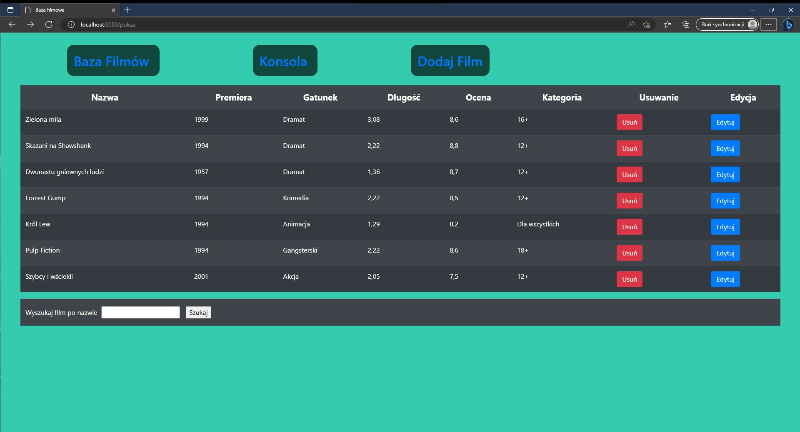
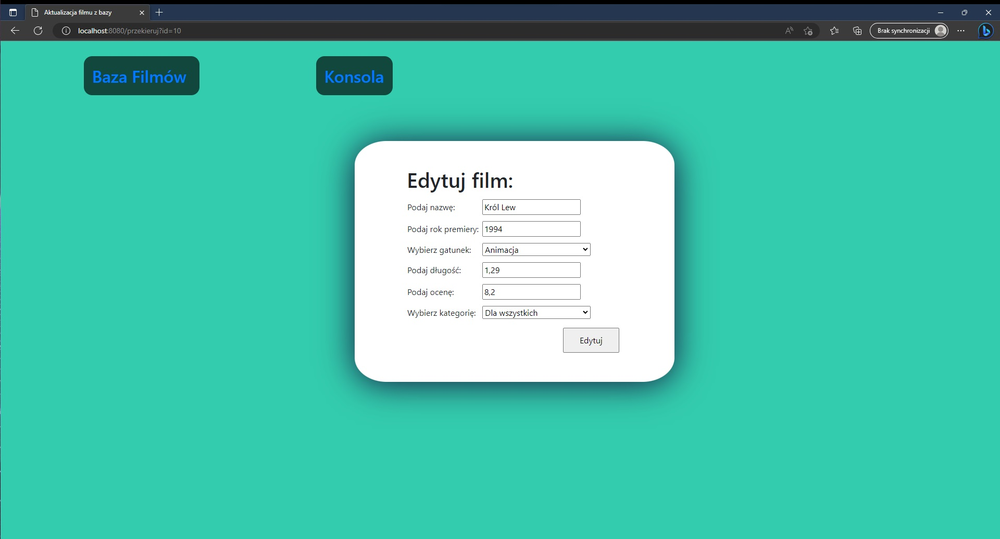
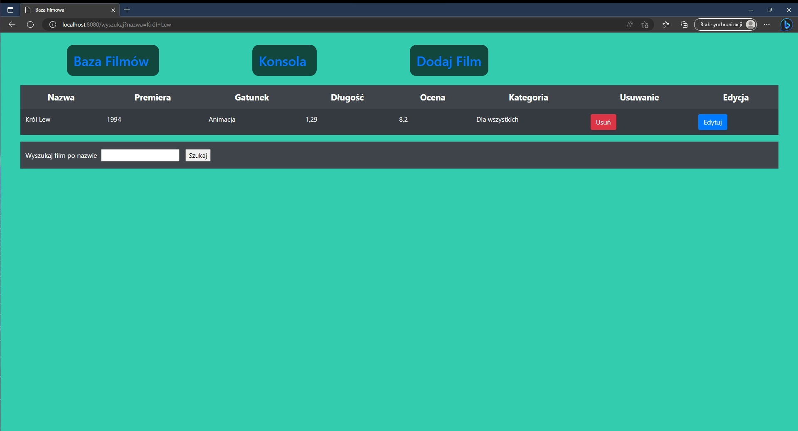
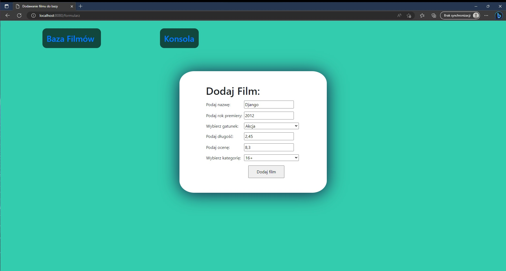
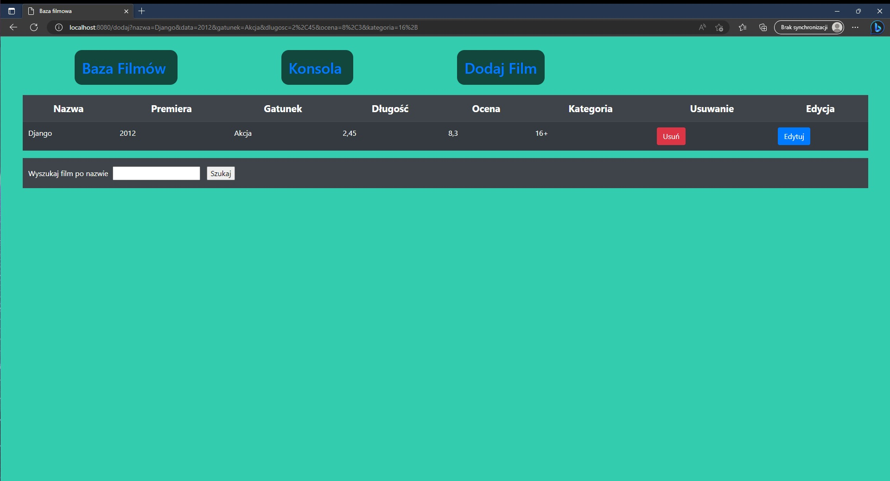
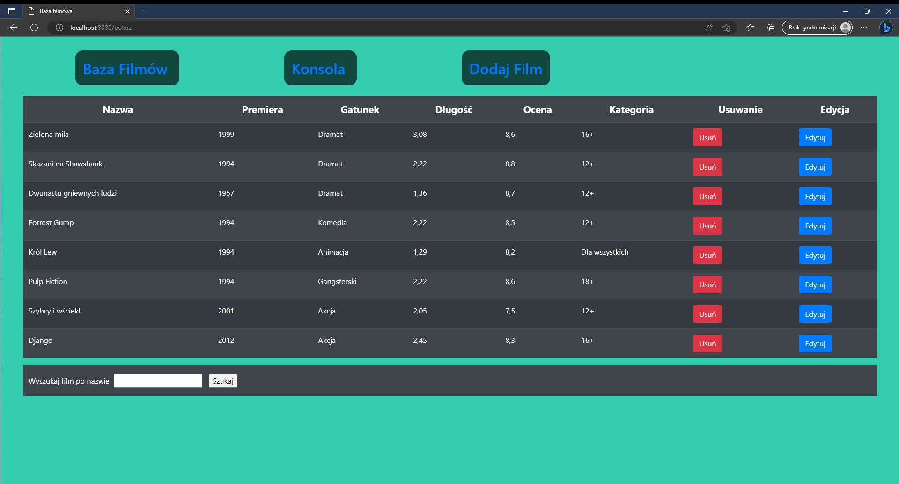

# Aplikacja bazodanowa z filmami

#### Projekt ten został wykonany na pierwszym roku informatyki na przedmiot "Aplikacje bazodanowe".

## Opis

#### Aplikacja bazodanowa umożliwia zarządzanie danymi o filmach. 

## Technologie
* Java
  * Springboot
  * Hibernate ORM
  * Thymeleaf
* HTML
* CSS
* Bootstrap

## Funkcjonalności

Aplikacja umożliwia:

* Wyświetlanie listy filmów.
* Dodawanie, usuwanie i modyfikację rekordów w bazie danych filmów.
* Wyszukiwanie filmów po tytule.

## Uruchomienie

1. Zaleca się otworzenie repozytorium w IntelliJ IDEA.
2. Następnie przejdź do pliku src/main/java/com.example.demo/DemoApplication.
3. Uruchom program za pomocą kombinacji klawiszy Ctrl+F5.
4. Otwórz przeglądarkę internetową i przejdź do adresu http://localhost:8080/pokaz

## Screeny

### Główny widok

  

### Widok edycji filmu

  

### Widok dodawania filmu

  

### Widok wyszukiwania filmu

  

## Przykład dodawania filmu

  

  

  

